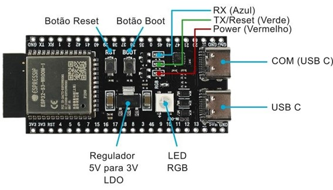

# Módulo ESP32-S3 DevKitC-1 N8R2 com WiFi e Bluetooth/BLE 5.0 - USB-C

## Escolher a **Placa ESP32S3 DEV Module** na IDE Arduino

O **ESP32-S3 DevKitC-1 N8R2** é um microcontrolador com antena integrada, ideal para projetos de IoT (Internet das Coisas). Ele se destaca pelo seu hardware poderoso, baixo custo e conectividade WiFi e Bluetooth/BLE 5.0. É amplamente aplicado em projetos eletrônicos, como computação de rede neural, IA e IAIoT (Inteligência Artificial das Coisas).

## **Características Principais**
- **Microprocessador:** Xtensa 32-Bits LX7 Dual Core com baixo consumo de energia.
- **Memória:** Flash externa de 8 MB (QD) e PSRAM de 2 MB (QD).
- **GPIOs:** 36 pinos programáveis.
- **Alimentação:** 3.3V (via USB-C ou entrada 5V).
- **LED RGB:** Integrado, controlado pela porta GPIO 48.
- **Conectividade:** WiFi 802.11 b/g/n (2.4 GHz) e Bluetooth 5.0.
- **Dimensões:** ~64x27x4,5mm.
  

---

## **Detalhes do Hardware**

### **Processador e Memória**
- **Processador:** Xtensa 32-Bits LX7 Dual Core.
- **Memória SRAM:** 512 KB.
- **Memória Flash:** 8 MB QD (Quad, 4 bits simultâneos para transferência).

### **Alimentação e Conectores**
- **Tensão de Alimentação:** 3,0 a 3,6 VDC.
- **Conector:** USB-C com suporte a OTG e JTAG.
- **Botões:** BOOT e Reset.

### **LEDs Indicativos**
- **Vermelho:** Indica alimentação conectada (3.3V).
- **Verde:** Associado ao TX e botão Reset.
- **Azul:** Pisca ao receber dados (RX).

### **GPIOs**
- 36 GPIOs configuráveis para diversas interfaces:
  - **UART**, **SPI**, **I2C**, **I2S**, **PWM**, **LCD**, **DVP**, etc.

---

## **Como Programar**

1. **Configuração Inicial:**
   - Conecte o módulo via USB-C à porta destacada como "COM".
   - Instale o suporte para ESP32 na **Arduino IDE**:
     - Vá em **Ferramentas > Gerenciador de Placas > ESP32** e instale o pacote.

2. **Selecione a Placa:**
   - Escolha a opção **ESP32S3 Dev Module**.

3. **Carregar o Exemplo:**
   - Vá para **Arquivos > Exemplos > ESP32 > GPIO > BlinkRGB**.
   - Faça o upload do código.

4. **Teste:**
   - O LED RGB embutido alternará entre cores (vermelho, verde, azul, etc.).

---

## **Diagrama de Componentes**

- **Antena Integrada:** Ideal para conectividade WiFi e Bluetooth.
- **Porta USB-C:** Suporte a OTG e debug.
- **Barra de Pinos:** Conexões para jumpers ou soldagem.

---

## **Especificações Técnicas**

| **Especificação**             | **Descrição**                              |
|-------------------------------|--------------------------------------------|
| **Módulo**                    | ESP32-S3-WROOM-1                          |
| **Processador**               | Xtensa 32-Bits LX7 Dual Core              |
| **Memória SRAM**              | 512 KB                                    |
| **Memória Flash Externa**     | 8 MB QD                                   |
| **Tensão de Alimentação**     | 3,0 a 3,6 VDC                             |
| **Tensão de Nível Lógico**    | 3,3 VDC (não tolera 5V)                   |
| **Corrente de Consumo (típica)** | 41 mA                                    |
| **Corrente de Consumo (máxima)** | 56 mA                                    |
| **WiFi**                      | 802.11 b/g/n (2.4 GHz)                    |
| **Segurança WiFi**            | WPA/WPA2/WPA2-Enterprise/WPS              |
| **Bluetooth LE**              | Bluetooth 5.0, Bluetooth Mesh             |
| **Interfaces**                | UART, SPI, SDIO, I2C, I2S, PWM, LCD, DVP  |
| **Temperatura de Trabalho**   | -40° a +85°C                              |
| **GPIOs Programáveis**        | 36                                        |
| **Dimensões**                 | ~64x27x4,5 mm                             |
| **Peso**                      | 8,5 g                                     |

---

# Documentação do Código: BLE Scan com Controle de LED RGB

## Resumo
Este código implementa a funcionalidade de varredura de dispositivos BLE (Bluetooth Low Energy) utilizando um ESP32. Além disso, controla um LED RGB para indicar diferentes estados durante a execução.

## Funcionalidades
1. **Varredura de dispositivos BLE:**
   - Detecta dispositivos BLE próximos.
   - Calcula a distância aproximada com base no RSSI.
   - Filtra dispositivos a mais de 5 metros.
   - Ordena dispositivos por distância em ordem crescente.

2. **Indicação de estados por LED RGB:**
   - **Vermelho:** Nenhum dispositivo encontrado.
   - **Azul:** Dispositivos encontrados.
   - **Verde:** Dispositivo próximo (menos de 1 metro).

3. **Saída Serial:**
   - Exibe os dispositivos encontrados em uma tabela, incluindo:
     - Nome do dispositivo.
     - Endereço MAC.
     - RSSI.
     - Distância calculada (em metros).

## Fluxo do código

### Varredura BLE:

    * Realiza a varredura por 5 segundos.
    * Filtra dispositivos além de 5 metros.

### Ordenação e Exibição:

    * Ordena dispositivos por distância em ordem crescente.
    * Exibe os dispositivos em uma tabela na saída serial.

### Controle do LED RGB:

    * Determina a cor com base nos dispositivos detectados:
       *  Verde: Dispositivo próximo 
       *  Azul: Dispositivos encontrados.
      *   Vermelho: Nenhum dispositivo.

### Atraso:

    Aguarda 5 segundos antes da próxima varredura.
---
## Saida serial do ESP32 

| Dispositivo | MAC               | RSSI  | Distância (m) |
|-------------|-------------------|-------|---------------|
|             | de:2d:c4:6e:2d:5e | -86   | 16.55         |
|             | b0:e4:5c:42:b1:6b | -86   | 16.55         |
|             | c2:22:77:97:a1:63 | -89   | 21.52         |
|             | 57:a9:61:e4:ca:e2 | -89   | 21.52         |
|             | d0:95:68:a5:01:49 | -90   | 23.44         |
|             | 51:29:75:88:1c:03 | -92   | 27.75         |
|             | 7d:ac:b8:55:ef:04 | -92   | 27.75         |
|             | 70:fe:1f:c2:5b:52 | -92   | 27.75         |
|             | 36:b9:72:9b:25:b1 | -93   | 30.16         |
|             | 3e:87:6a:81:14:91 | -94   | 32.74         |
|             | 6e:9a:41:ef:ab:ab | -94   | 32.74         |
----------------------------------------------

